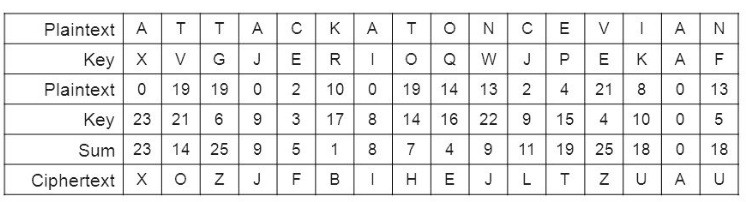

---
### Write your own Bitcoin clone in Python

Make your self at home...

 - Python 3 installed:
   - Windows: use the installer
   - Mac: `brew install python3`
 - The `python3` executable available in the terminal:
   - Windows users:
     * add it to your user's %PATH%
   - Try running `python3 -m "this"`
 - Use an editor you're comfortable with (e.g. PyCharm)

<style> .slides:first-child { font-size: 90% !important; } </style>

---
## Welcome to the workshop!

 > "I had to write all the code before I could convince myself that I could
 > solve every problem"

__*The author of Bitcoin.*__

---
## Your host

 - My name is __*Rigel*__
   * I work as an Architect for Wipro Digital
   * Co-founder of the Dublin Linux User Group
   * Member of the Blockchain Association of Ireland
 - My Github URL is https://github.com/zedr
 - Feel free to connect on Linkedin: https://linkedin.com/in/rigeldiscala

---
## Goals

 1. Have fun
 2. Build our own cryptocurrency
 3. Be amazed

---
## How it will work

 - Divided in __*5 Acts*__
 - We'll start from zero, __nada__, nothing
 - We'll take short breaks along the way

---
## If you get stuck

Visit the URL in the footnote:

https://tinyurl.com/pycoin-latest

Download the file and craic on.

---
# Caveats

 0. First time I run this workshop! (__*yikes*__!)
 1. __*Not*__ an expert in any of these fields:
   - ICOs
   - Crypto
   - Finance
 2. We will take unsafe shortcuts
 3. A subset of Bitcoin, not all of it (e.g. no wallets)
 4. "Type along" style; diverge at your own risk!

---
# Quick Quiz
## Win __*monetary*__ prizes!

---
## Who invented Bitcoin?

 - Al Gore |
 - Satoshi Nakamoto |
 - Ryuichi Sakamoto |

---
## What is __*fiat*__ currency?

 - Money you pay to "fix it again" |
 - Money based on the Gold Standard |
 - Money for nothing |

---
## What Python keyword is used to create generators?

 - gen |
 - yield |
 - weep |

---


---
## What is money?

 - A store of value
   - Can be reliably stored and retrieved
 - A medium of exchange
   - Intermediation, avoid bartering
 - A unit of account
   - Used to measure the value of things
 - A standard of deferred payment
   - Debt is key to our financial system

---
### No, really, what is money?

 - And where does its value come from?
   - Scarcity? (e.g. gold)
   - Labor? What is gained exactly?
   - Debt?

 - What stops up from creating our own money? ;) |

---
 > We need to solve three functional problems
 > 1. How to exchange information anonymously between a disconnected group of people
 > 2. How to create authentic identities that can collect credit
 > 3. How to send information directly from one such identity to another, across any distance, in full security

__*Pieter Hintjens*__, "Hacking the Edges"

---
## What do we need?

 - One or more computers |
 - A communication network |
 - A common protocol |
 - ... and maybe something else... |

---
# Act 1: the peer-to-peer network

 > Cypherpunks write code. (...) We know that software can't be destroyed
 > and that a widely dispersed system can't be shut down. 

__*Eric Hughes*__, A Cypherpunk's Manifesto

---
## Radios

 - Information transmitted and received through space using eletromagnetic energy
 - Anybody with a full-duplex radio system and an antenna can join the conversation
 - A radio tuner is necessary to tune into a specific frequency (3kHz - 300GHz)


---
## CB - Citizens band radio

In Ireland: Band D (~27MHz)


---
## We need something similar...

 - Receive/transmit data using raw TCP/IP (the ether)
 - A common client (radio system)
 - A common protocol (e.g. frequency, language, etc.)

---
## Let's start coding our radio: main.py

---
## A simple repl

 - Read -> Eval -> Print -> Loop


---
## Networking
### Broadcasting messages

 - Recipents: anybody who understands the protocol

---
## Where to send our messages

 - Open the terminal
 - Type:
    `ipconfig` on Windows
    `ifconfig` on Linux/Mac OS

```
inet addr:192.168.0.115  
Bcast:192.168.0.255 
Mask:255.255.255.0
```

---


---
# asyncio

---
# The event loop

 - The central execution device provided by asyncio.
 - Provides facilities for:
   - Registering, executing and cancelling delayed calls (timeouts).
   - Creating client and server transports for various kinds of communication.

---
## Tiny example

```python
import asyncio

async def f(uid):
    await asyncio.sleep(uid ** 2)
    print(uid)

loop = asyncio.get_event_loop()
loop.run_until_complete(asyncio.gather(
    f(1),
    f(2)
))
loop.close()
```

---
## Let's implement it

Two coroutines:

 - One for the REPL
 - One for the Network handler

Remember: coroutines are really just fancy generator functions.

---
# Act 2: asymmetric encryption
## How to share a secret between far away strangers?
 
 > Privacy is the power to selectively reveal oneself to the world

__*Eric Hughes*__, A Cypherpunk's Manifesto

---
## Plan A: use a shared secret key

---
### One-time pads


---



---
### Number stations


---
## Plan B: use two personal secret keys

 - Double padlock

---
### Public key cryptography
### AKA Plan C: public and private keys

 - Makes e-commerce a $1.95 Trillion industry
 - Projected to top $4 Trillion in 2020

---


---
## Basic concepts
### Each party has two keys:

 - Public keys are shared with anyone
 - Private keys are kept secret
 - You can't deduce a private key from a public key

---
## Basic concepts (2)

 - Alice encrypts a message with her private key
 - Anyone with her public key can read it

---

## Basic concepts (3)

 - Alice encrypts a message with Bob's public key
 - Only Bob can read it

---

## Basic concepts (4)

 - Alice wants to prove a message comes from her
 - Alice encrypts the message using her public key
 - OR, Alice encrypts the fingerprint of the message (signs it)

---
### Implementing a RSA-like cypher

 - start with a prime number
 - generate prime numbers
 - implement extended euclidean algorithm
 - implement multiplicative inverse
 - define P, Q, CONSTANT, MODULUS, PRIVATE_KEY, PUBLIC_KEY
 - implement enc single char
 - implement enc string
 - prime factorisation
    - factoring very large numbers is very hard
    - there is only *one* set of prime factors for any number

---
# Encryption and decryption

---
# Signatures

---
# Signing network messages

---
# Layered view (Satoshi client)

```
 Validating transactions; Managing blockchain, mempool, peers
                   |
      Scripting engine / Signatures (Consensus code)
                   |
             Network layer  (P2P code)
                   |
             P2P Messages
```
https://en.bitcoin.it/wiki/Bitcoin_Core_0.11_(ch_1):_Overview

---
# Layered view (simple)

 - Protocol
 - Network
 - Carrier

---
# Act 3: Transactions


 - We won't cover:
    - multiple inputs
    - transaction fees
    - wallets

 - We will have Coinbase (mining rewards)
 - We need multiple outputs (for Coinbase)

---


---
# Act 4: The Blockchain

---
# Blocks

    - Link to an ancestor block
        - Except for the Genesis block
    - Holds one or more transactions


---
# Anatomy of a block

 - First transaction must be coinbase (i.e. only 1 input), the rest must not be.

---
# Initial Block Download

Once a new node joins the network, its first order of business is to **download**
and **validate** the entire blockchain.

---
# Final Act : Proof of work

 > The supply of money should rise at a constant rate

__*Satoshi Nakamoto*__

---
# Proof of work

 - Hard to produce
 - Selectable amount of work
 - Easily verifiable

---
# Consensus

The longest valid chain is the canonical one.
